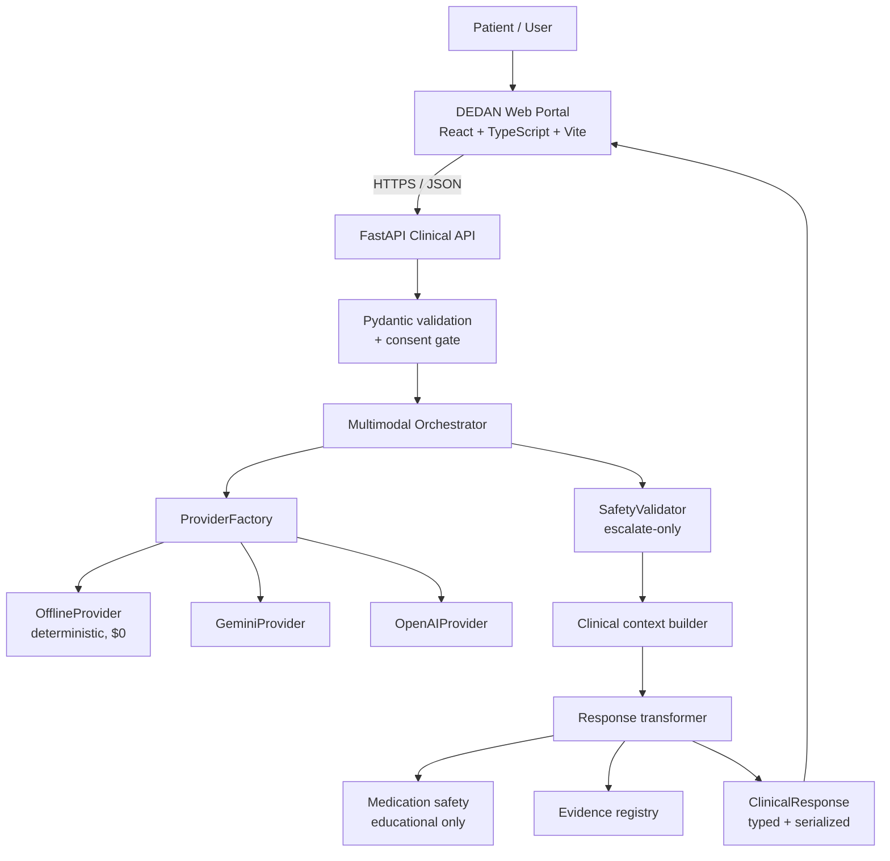

# DEDAN Health

**Multimodal AI health-navigation and clinical decision-support platform**, built
with FastAPI, React, and AI provider orchestration.

DEDAN accepts a patient-described problem (text, images, or a voice transcript)
plus clinical context, runs it through an orchestrated pipeline, and returns a
**structured, safety-validated document** that separates health education from
clinical instructions. It is a health-navigation tool, **not a diagnostic
system** — see [Medical Safety & Limitations](#medical-safety--limitations).

> **Status: development-ready prototype.** Not clinically validated, not
> certified, and not approved by any regulator or standards body. Every
> capability described below corresponds to code in this repository; anything
> that is planned rather than implemented is labelled as such.

[Architecture](docs/architecture.md) ·
[API](docs/api.md) ·
[Development](docs/development.md) ·
[Security](SECURITY.md) ·
[Engineering Decisions](docs/engineering-decisions.md)

---

## Overview

The engineering problem this repository addresses is **turning a
general-purpose language model into a component that is safe to point at health
questions**. A raw LLM call is the wrong shape for that job: it returns prose,
it has no notion of urgency, and nothing in its output distinguishes a
retrieved guideline from a generated guess.

DEDAN's answer is a pipeline with a typed contract at every hand-off:

```
Input (text / image / voice transcript)
  ↓
Validation            Pydantic request models; consent gate
  ↓
Clinical context      Patient profile, symptoms, duration, severity, history
  ↓
Multimodal analysis   Provider abstraction → Gemini / OpenAI / Offline
  ↓
Evidence retrieval    Authoritative source registry (see limitations)
  ↓
Safety validation     Red-flag escalation, never-silently-downgrade rule
  ↓
Structured response   Typed clinical schema, guaranteed field names
  ↓
Education + next steps, including explicit uncertainty
```

The output is a **document with a fixed shape**, not a paragraph. A client can
rely on `safety.urgency`, `possible_explanations[]`,
`medication_information[].is_educational_only`, and `sources[]` being present
and correctly typed. That is enforced by tests, not by convention.

## Why DEDAN Health?

Most "AI health" projects are a prompt wrapped in a chat UI. The engineering
interest here is in the parts a chat UI hides:

| Problem | How DEDAN addresses it |
| --- | --- |
| Model output is unstructured prose | Typed provider contract → `ClinicalResponse` tree with a serializer |
| A model may *downplay* a serious symptom | Safety validator that escalates on red-flag keywords and never lowers urgency |
| "Take 500 mg ibuprofen" is unsafe to generate | Prescription-detail detection (dosage patterns + drug names) flags the response |
| Providers differ, change, and cost money | `ProviderFactory` + capability routing + a deterministic offline provider |
| You cannot test code that calls a paid API | Offline provider: 53 hermetic backend tests, no credentials, no network |
| A green build that silently tests nothing | System test asserts the *content* of a real response, not just its status code |

## Core Capabilities

**Implemented and tested:**

- **Text symptom assessment** with patient context (age, sex, location,
  language, pregnancy, chronic conditions, medications, allergies) and
  conversation history.
- **Image input** — upload, magic-byte MIME sniffing, quality gating (minimum
  224×224, minimum 1 KiB, aspect-ratio warnings), 24-hour TTL, expiry cleanup.
- **Voice transcript input** — accepted as text from the client. *Speech-to-text
  is **not** implemented in the backend; see
  [docs/multimodal.md](docs/multimodal.md).*
- **Safety classification** — `routine` / `soon` / `urgent` / `emergency`, with
  emergency red-flag escalation and country-specific emergency numbers.
- **Educational medication information** — always flagged `is_educational_only`,
  with a pharmacy package-verification workflow. Never a prescription.
- **Evidence source registry** — prioritised authoritative sources. *Currently a
  curated registry that constructs citations, **not** a live retrieval system;
  see [docs/evidence-citation-registry.md](docs/evidence-citation-registry.md).*
- **Rate limiting, CORS, structured error envelopes, stack-trace suppression.**

**Prototype / not wired into the running system:** the LangChain+CrewAI agent
graph (`backend-v2/agents/`), billing, chronic-care, hub, and EMR modules, the
React Native mobile app, the clinic dashboard, the messaging backend, and the
Kubernetes manifests. These exist as code but are **not** part of the verified
system described here.

## Architecture



Component responsibilities and the reasoning behind the separation are in
[docs/architecture.md](docs/architecture.md). Source:
[`docs/diagrams/architecture.mmd`](docs/diagrams/architecture.mmd).

## Technology Stack

Only technologies actually present in this repository are listed.

| Layer | Technology |
| --- | --- |
| Frontend | React 18, TypeScript 5 |
| Build / dev server | Vite 5 |
| UI components | MUI 5 (`@mui/material`, `@emotion`) |
| Frontend routing | React Router 6 |
| Frontend tests | Jest 30, jsdom, Babel, Testing Library |
| Backend | FastAPI, Uvicorn |
| Runtime | Python 3.11+ (developed and verified on 3.14) |
| Validation / config | Pydantic 2, pydantic-settings |
| AI providers | Google Gemini (`google-generativeai`), OpenAI (`openai`) |
| Offline provider | Built-in, no external dependency |
| HTTP | REST (JSON) |
| Backend tests | pytest, Starlette `TestClient` |
| Static checks | `tsc --noEmit`, `pytest` |
| Containerisation | **Not implemented** — see [docs/deployment.md](docs/deployment.md) |
| CI | GitHub Actions — [.github/workflows/ci.yml](.github/workflows/ci.yml) |

Explicitly **not** on the verified runtime path: Docker, Kubernetes (manifests
only, never applied), Redis, Celery, SQLAlchemy, LangChain, CrewAI, ChromaDB,
and sentence-transformers. These appear in module imports or planning documents
but are not required to run or test the Clinical API.

## System Flow

A single `POST /api/analyze` request traverses:

1. **Rate-limit check** — per-client-IP sliding window (30 req/min default).
2. **Validation** — `AnalyzeRequest` (Pydantic). Out-of-range age or sex → `422`.
3. **Consent gate** — `consent: false` → `400`, enforced before any AI work.
4. **Image resolution** — `image_ids` resolved from storage; `image_data_list`
   decoded, including `data:` URI prefixes.
5. **Context assembly** — text, duration, severity, transcript, history, and
   patient profile combined into one clinical context object.
6. **Provider selection** — capability-based routing; offline unless a *usable*
   credential is configured.
7. **Safety validation** — red-flag detection, uncertainty detection,
   prescription-detail detection, disclaimer verification.
8. **Clinical context build** → **response transform** → **education and
   medication enrichment** → **serialization** to a fixed dict shape.
9. **Background audit log** — request ID, session, urgency, confidence, provider,
   latency, safety flags.

## Multimodal AI Pipeline

`Modality` is defined for `text`, `image`, `audio`, `video`, and `document`.
The Clinical API currently accepts **text, images, and a pre-transcribed voice
string**; audio bytes are not decoded server-side. Full per-modality
documentation, including what is *not* implemented, is in
[docs/multimodal.md](docs/multimodal.md).

All providers implement the same `MultimodalAIProvider` contract, so the
orchestrator never branches on vendor:

| Provider | Module | Requires credentials | Cost | In CI |
| --- | --- | --- | --- | --- |
| `offline` | `providers/offline_provider.py` | **No** | $0 | Yes |
| `gemini` | `providers/gemini_provider.py` | Yes | Usage-billed | No |
| `openai` | `providers/openai_provider.py` | Yes | Usage-billed | No |

Mock mode needs **no credentials at all** — verified by running the API with
every credential and mode variable unset. Full configuration reference:
[docs/ai-providers.md](docs/ai-providers.md).

## Evidence Citation Registry

`EvidenceRetriever` maintains a prioritised registry of authoritative sources
(WHO, CDC, FDA, NICE, MSF, PubMed, Mayo Clinic, Cleveland Clinic) and attaches
citations to responses, scaling the source set by requested evidence level.

**Be precise about what this is today:** it builds *citations to a curated
source list*. **The module contains no HTTP client and performs no network
requests.** It does not fetch, index, or quote source documents, and
`date_published` is never populated. Responses therefore carry source
*provenance metadata*, not verified quotations. Nothing in a response has been
checked against the source it cites.

See [docs/evidence-citation-registry.md](docs/evidence-citation-registry.md) for
the full statement of limitations and the path to real retrieval.

## Medication Safety

Three concepts are kept strictly separate:

| Concept | Status in this repo |
| --- | --- |
| Medication **information** | Implemented — class, purpose, warnings, contraindications, interactions |
| Medication **verification** | Implemented as a *user-side checklist* of package items to confirm at a pharmacy |
| Clinical **prescribing** | **Not implemented and not attempted** |

Every medication entry is serialized with `is_educational_only: true`, asserted
by both the pytest suite and the system test. The safety validator additionally
scans output for dosage patterns (`500 mg`, `3 times daily`) and drug names and
flags responses that read as prescribing. Details in
[docs/medication-safety.md](docs/medication-safety.md).
## Local Development

### Quick Start

```bash
git clone https://github.com/Dan12-dev-ai/dedan-health.git
cd dedan-health
./scripts/setup-and-run.sh
```

This creates a virtualenv, installs backend and frontend dependencies, and
starts both services in **offline mode** — no API keys, no network calls, no
cost.

| Service | URL |
| --- | --- |
| Web portal | http://localhost:3000 |
| API | http://localhost:8001 |
| API docs | http://localhost:8001/docs |

Stop with `./scripts/stop.sh`; verify with `./scripts/health-check.sh`.

### Prerequisites

- Python 3.11+
- Node.js 18+

### Manual Setup

```bash
python3 -m venv .venv
.venv/bin/pip install -r backend-v2/requirements.txt
cp backend-v2/.env.example backend-v2/.env

cd web-portal && npm install
```

### Make Targets

| Target | Action |
| --- | --- |
| `make setup` | Install backend + frontend dependencies |
| `make run` | Set up and start both services |
| `make stop` | Stop DEDAN services (scoped to this checkout) |
| `make test` | Run backend and frontend test suites |
| `make lint` | `tsc --noEmit` + Python byte-compile |
| `make format` | Normalise whitespace |
| `make health` | Check the running system |
| `make clean` | Remove caches and build output |

## Configuration

Configuration is environment-driven via `pydantic-settings`
(`backend-v2/app/core/config.py`). Copy `backend-v2/.env.example` to
`backend-v2/.env`. A root `.env.example` documents the system-level variables.

The only switch most contributors need:

```env
AI_PROVIDER_MODE=offline   # deterministic, $0, no credentials
```

**Mock / offline mode:** `$0`, no external AI API, no network. Every endpoint
works; responses come from a deterministic rules engine and are labelled
`provider: "offline"` with an explicit safety notice.

**Live mode:** set `AI_PROVIDER_MODE` to `gemini` or `openai` and provide a real
credential. Usage **may incur provider charges.** `ProviderFactory` refuses to
call a provider whose key looks like a placeholder (`test-key`, `changeme`, …).

## Testing

```bash
make test                                 # backend + frontend
cd backend-v2 && python3 -m pytest tests/ -v
cd web-portal && npm test
./scripts/test-system.sh                  # end-to-end smoke test
```

The backend suite covers health and discovery endpoints, request validation
(missing / malformed / out-of-range), the `/api/analyze` happy path and response
shape, red-flag escalation, consent enforcement, image upload lifecycle and
rejection paths, medication educational-only guarantees, and error-envelope
shape including stack-trace suppression.

### Test Results

Verified on Python 3.14.6 / Node 22.23.2:

| Check | Command | Result |
| --- | --- | --- |
| Backend tests | `pytest tests/` (53 tests) | **PASS** |
| Frontend tests | `npm test` (25 tests) | **PASS** |
| TypeScript | `tsc --noEmit` | **PASS** (0 errors) |
| Frontend build | `npm run build` | **PASS** |
| System test | `./scripts/test-system.sh` | **PASS** |
| GitHub Actions | CI (backend, frontend, shell) | **PASS** |

## Project Structure

```
DEDAN-Health/
├── backend-v2/              # AUTHORITATIVE backend (FastAPI Clinical API)
│   ├── main_clinical.py     # App factory, middleware, endpoints
│   ├── clinical_schema.py   # ClinicalResponse schema + serializer
│   ├── safety_validator.py  # Escalation and prescribing detection
│   ├── image_service.py     # Upload, validation, TTL storage
│   ├── providers/           # Provider abstraction + offline/gemini/openai
│   ├── models/              # Pydantic request/response models
│   ├── app/core/config.py   # Environment-driven settings
│   └── tests/               # pytest suite
├── web-portal/              # AUTHORITATIVE frontend (React + TS + Vite)
│   ├── src/pages/           # Assess, Results, History, Consent, …
│   ├── src/services/        # Typed API client, multimodal service
│   ├── src/design-system/   # Tokens, TrustBanner, SeverityBadge
│   └── src/__tests__/       # Jest suite
├── scripts/                 # setup-and-run, stop, health-check, test-system
├── docs/                    # Architecture, API, security, decisions, …
│   ├── architecture.md      # Verified components and why they are separated
│   ├── api.md               # Every endpoint, with real schemas and responses
│   ├── ai-providers.md      # Provider selection and credential-free mock mode
│   ├── evidence-citation-registry.md  # Citations — NOT retrieval
│   ├── security.md          # Controls that exist, and what does not
│   ├── medication-safety.md # Information vs verification vs prescribing
│   ├── multimodal.md        # Per-modality support, incl. what is missing
│   ├── testing.md           # Test layers and coverage gaps
│   ├── development.md       # Setup, configuration, debugging
│   ├── deployment.md        # Local only; containers are not implemented
│   ├── engineering-decisions.md    # ADRs with trade-offs
│   ├── engineering-highlights.md  # Problems actually solved
│   ├── troubleshooting.md   # Failure modes
│   └── diagrams/            # Mermaid sources
├── data/clinical_guidelines/# Guideline JSON — see PROVENANCE.md (licence
│                             # excluded; NOT used by the verified API)
├── kubernetes/              # Manifests only — not deployed
├── backend/, mobile-app/, mobile/, web/,
│   clinic-dashboard/, messaging-backend/   # PROTOTYPES (see docs/architecture.md)
└── Makefile
```

## Security

> ⛔ **Production blocker: the API has no authentication.** Every endpoint is
> public. Do not expose this service to an untrusted network or handle real
> patient data with it. See [docs/security.md](docs/security.md).

- `.env` files are git-ignored; only `*.example` templates are tracked.
- No credentials are present in the repository or its history.
- Provider keys are never logged; logging emits request IDs, timing, and safety
  flags only.
- `DEBUG=false` suppresses stack traces and internal exception types from error
  bodies, and disables `/docs`, `/redoc`, and `/openapi.json`.
- Uploads are validated by magic bytes, size, and dimensions before storage.
- Rate limiting is applied per client IP.

**Not implemented:** authentication, authorization, encryption at rest,
persistent audit logging, key rotation, dependency scanning, and automated data
retention. [SECURITY.md](SECURITY.md) and [docs/security.md](docs/security.md)
state precisely what a production healthcare deployment would require.

## Medical Safety & Limitations

DEDAN Health is a **health-navigation and clinical decision-support system**.

- **It does not diagnose disease.** Outputs are labelled "possible explanations"
  with an explicit evidence level and an uncertainty statement.
- **AI output can be incorrect.** Language models hallucinate, omit, and
  occasionally mis-rank clinical information. The safety layer reduces but does
  not eliminate this risk.
- **It is not a substitute for a qualified healthcare professional.** Every
  response carries a disclaimer to that effect, asserted by tests.
- **Emergency symptoms require emergency care.** Red-flag detection is
  keyword-based; it will miss presentations it was not written for.
- **Medication information must be verified** against a pharmacy label or an
  authoritative source. DEDAN does not prescribe.
- **Not clinically validated.** No prospective study, no outcome evaluation, and
  no regulator review has been performed.
- **No compliance certification is claimed.** DEDAN is not HIPAA, GDPR, FDA, or
  WHO certified and makes no such claim. What would be required is described in
  [docs/security.md](docs/security.md).

## Deployment

**Currently verified:** local development only, via `./scripts/setup-and-run.sh`
or `make run`.

**Not implemented:** Docker images, cloud deployment, and applied Kubernetes
manifests. The `kubernetes/` directory contains YAML that has not been validated
against a cluster.

> Cloud deployment is not currently part of the verified repository state.

See [docs/deployment.md](docs/deployment.md).

## Engineering Decisions

Architecture decisions are recorded in ADR format in
[docs/engineering-decisions.md](docs/engineering-decisions.md) — including why
FastAPI, why a provider abstraction, why a deterministic offline provider, why
typed response models, and why frontend and backend are deployed separately.

## Roadmap

- [ ] Authenticate the API and scope privileged operations
- [ ] Replace the evidence registry with real retrieval and quotation
- [ ] Implement server-side speech-to-text for the voice modality
- [ ] Extend tests to cover the full error-envelope contract
- [ ] Persist and harden the audit log
- [ ] Containerise the API and portal
- [ ] Add dependency scanning to CI
- [ ] Retire or quarantine the prototype agent graph

## Contributing

See [CONTRIBUTING.md](CONTRIBUTING.md). Contributions that change clinical safety
behaviour require a clinical-safety rationale in the PR description.

## License

The source code in `backend-v2/`, `web-portal/`, `scripts/`, and the
documentation is offered under the [MIT License](LICENSE).

**Two exclusions, both deliberate:**

- `data/clinical_guidelines/` is **not** covered. Those files are attributed
  to the World Health Organization and their redistribution rights are
  unresolved — see
  [PROVENANCE.md](data/clinical_guidelines/PROVENANCE.md). They are not used by
  the verified Clinical API, so removing them would not change system
  behaviour.
- Brand assets (`logo.jpeg`, `web-portal/public/images/`) are not covered.

**The copyright holder in `LICENSE` is still a placeholder and has not been
verified.** It must be replaced with the real holder.

---

> DEDAN Health provides health education and navigation. It is not a substitute
> for professional medical advice, diagnosis, or treatment.


## API

Interactive docs are served at `/docs` when `DEBUG=true`. Full reference with
real schemas: [docs/api.md](docs/api.md).

| Method | Path | Purpose | Auth |
| --- | --- | --- | --- |
| `GET` | `/` | Service metadata | None |
| `GET` | `/api/health` | Structured health check | None |
| `GET` | `/health` | Legacy probe alias | None |
| `GET` | `/api/providers` | Provider registry | None |
| `POST` | `/api/analyze` | Clinical analysis | None (consent field required) |
| `POST` | `/api/images/upload` | Multipart image upload | None |
| `POST` | `/api/images/upload-base64` | Base64 image upload | None |
| `GET` | `/api/images/{id}` | Image metadata | None |
| `GET` | `/api/images/{id}/preview` | Image bytes as base64 | None |
| `DELETE` | `/api/images/{id}` | Delete an image | None |

**There is no authentication or authorization on any endpoint.** This is a
production blocker; see [docs/security.md](docs/security.md) for what would be
required before any network exposure.


